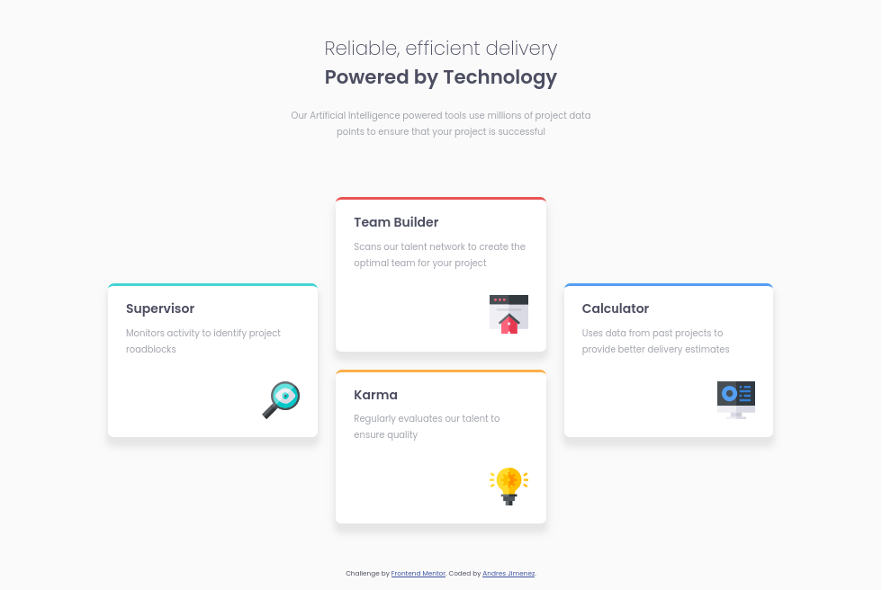

# Frontend Mentor - Four card feature section solution

This is a solution to the [Four card feature section challenge on Frontend Mentor](https://www.frontendmentor.io/challenges/four-card-feature-section-weK1eFYK). Frontend Mentor challenges help you improve your coding skills by building realistic projects. 

## Table of contents

- [Overview](#overview)
  - [The challenge](#the-challenge)
  - [Screenshot](#screenshot)
  - [Links](#links)
- [My process](#my-process)
  - [Built with](#built-with)
  - [What I learned](#what-i-learned)
  - [Continued development](#continued-development)
- [Author](#author)

## Overview

### The challenge

Users should be able to:

- View the optimal layout for the site depending on their device's screen size

### Screenshot



### Links

- Solution URL: [https://github.com/andresj24/four-card-feature-section-master](https://github.com/andresj24/four-card-feature-section-master)
- Live Site URL: [https://euphonious-creponne-812155.netlify.app/](https://euphonious-creponne-812155.netlify.app/)

## My process

### Built with

- Semantic HTML5 markup
- CSS custom properties
- Flexbox
- CSS Grid
- Mobile-first workflow

### What I learned

In this challenge you can test what you have learned regarding CSS Grid, and the positioning of elements using this tool, you can also implement the use of the "nth-child()" pseudoclass to add specific values ​​for each of the four cards present . 

```css
.card:nth-child(1) {
    border-top: 5px solid var(--cyan);
} 

```

Also try implementing semantic HTML.

### Continued development

For future projects I will continue to prioritize the "mobile-first" approach, as well as the use of CSS Grid, and soon I will begin the selection and development of projects that allow me to strengthen and practice the implementation of the JavaScript language, and tools such as CSS preprocessors (SASS).

## Author

- Frontend Mentor - [@andresj24](https://www.frontendmentor.io/profile/andresj24)
- Twitter - [@AndresitoJ96](https://www.twitter.com/andresitoj96)


